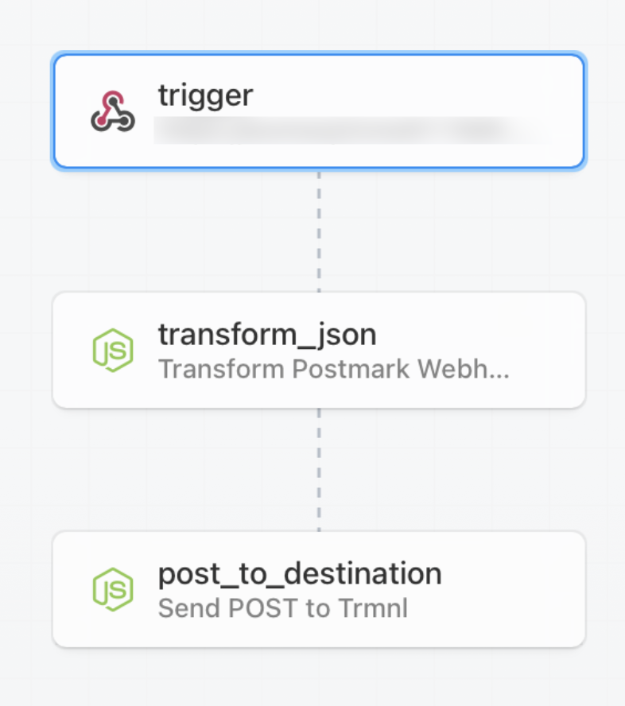

# Postmark To TRMNL

This is an entry for the [Postmark Challenge: Inbox Innovators on DEV.to](https://dev.to/challenges/postmark).

## 1. Postmark Inbound Stream

## 2. Pipedream Workflow

The [Pipedream](https://pipedream.com) workflow is a set of serverless functions triggered by the Postmark webhook.

The workflow transforms the incoming Postmark webhook into a JSON payload that is expected by the [TRMNL API](https://docs.usetrmnl.com/go/private-plugins/create-a-screen#set-new-content), then POSTs it to the URL of the private plugin.

The `PLUGIN_WEBHOOK_URL` variable [must be set](https://pipedream.com/docs/workflows/environment-variables/) (get it from the next step).

## 3. TRMNL Plugin

TODO